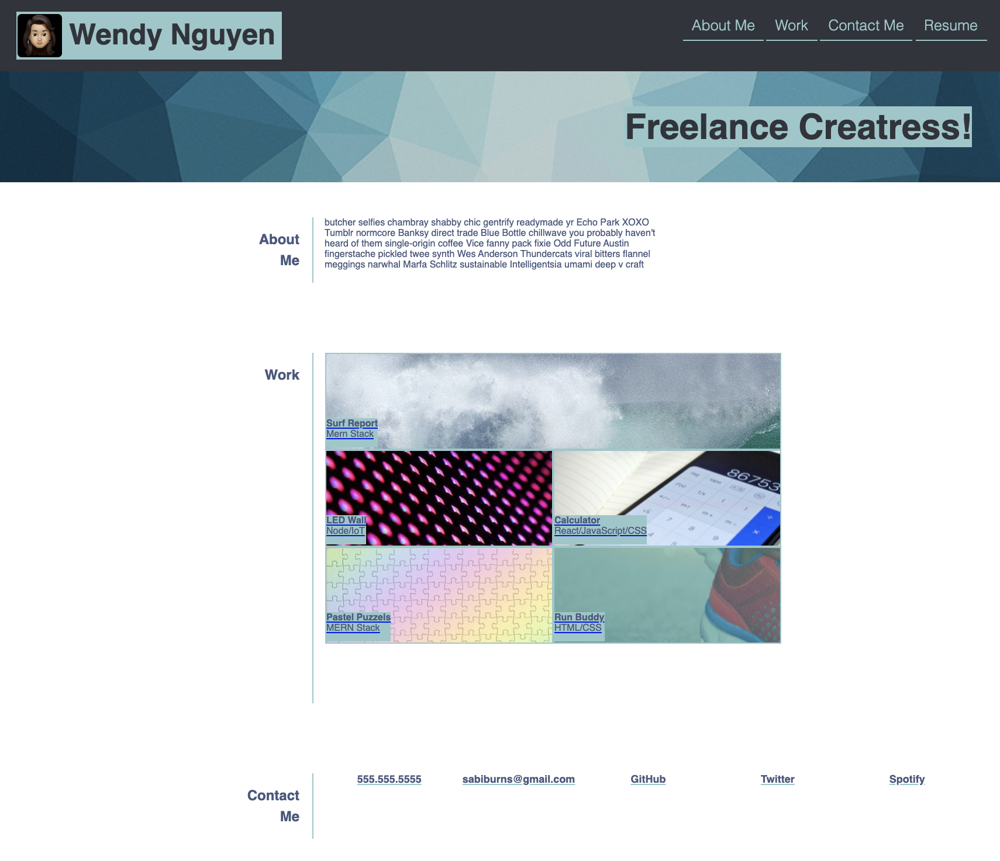

# WQN Portfolion

## Introduction
This was a solo project implemented for UCB Full Stack Bootcamp 2021. The project was to implement a portoflio website for a full stack bootcamp study starting a new career as a web developer

Visit the [live demo](https://wendyqnguyen.github.io/wqn-portfolio/)!

## Built With
* HTML
* CSS

## Screenshot

### Deployment

This application is currently deployed on GitHub.

## Contribution
- Wendy Nguyen - [@linkedln](https://www.linkedin.com/in/wenguyen/)
- Martin Adams - https://unsplash.com/@martinadams

### ©️2021 Wendy Nguyen 
